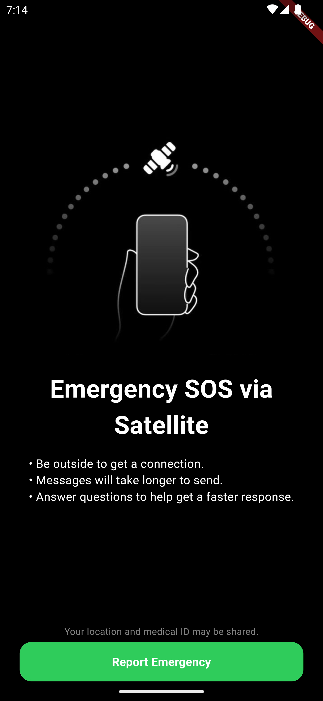
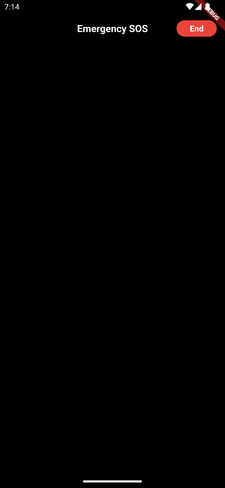

# SOS Emergency Satellite

This Flutter project is a recreation of Apple's 'SOS Emergency by Satellite' application, focusing exclusively on the visual and design aspect.
Using the Flutter framework, user interface elements were implemented to reproduce the modern and intuitive aesthetic of the original application. Although it contains no operational functionality, the project highlights Flutter's ability to offer a consistent and attractive user experience, with attention to design detail and responsiveness.

## Screenshots

| Image | Description |
|--------|-----------|
|  | Homescreen |
|  | Connection Screen (not finished) |
|  | Unavaliable |

